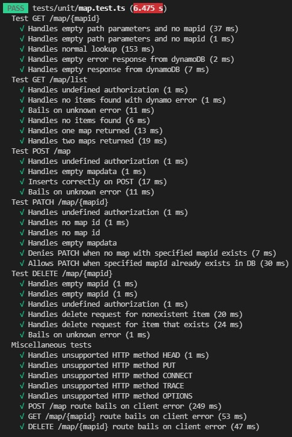

# FIT3162 Group 5 Backend


[](https://github.com/FIT3161ActivityTeam5/backend/actions/workflows/node.js.yml)

This is our backend application for Thrive, developed using TypeScript and the AWS CDK.

- [FIT3162 Group 5 Backend](#fit3162-group-5-backend)
  - [Deploying](#deploying)
  - [API Reference](#api-reference)
    - [GET `/map/{mapid}`](#get-mapmapid)
    - [GET `/map/list`](#get-maplist)
    - [POST `/map`](#post-map)
    - [PATCH `/map/{mapid}`](#patch-mapmapid)
    - [DELETE `/map/{mapid}`](#delete-mapmapid)
  - [Testing](#testing)

## Deploying

-   Clone the repo
-   Run `npm install`
-   `cd` to `lib/src/map` and run `npm install`
-   Install the AWS CDK if you haven't already: `npm install -g aws-cdk`
    -   Ensure your AWS credentials are set at `~/.aws`
    -   You may also need to bootstrap your AWS environment - more details [here](https://docs.aws.amazon.com/cdk/latest/guide/bootstrapping.html)
-   `cd` back to the main directory and run `./cdk.ps1 deploy`
    -   This will compile all the Lambda functions and deploy the stack to your AWS account

## API Reference

### GET `/map/{mapid}`

Retrieves the map specified by `mapid`. You'll get a `404` if there is no map found.
Example return data:

```json
[
    {
        "associatedUserID": "1ifcwRUJTtNeWWYHuZ3kayE8ARywmtKI@clients",
        "mapData": "someMapData",
        "mapID": "1234ff"
    }
]
```

### GET `/map/list`

Gives a list of the maps associated with the user.
The user is inferred from the JWT token.

Example return data:

```json
[
    {
        "associatedUserID": "1ifcwRUJTtNeWWYHuZ3kayE8ARywmtKI@clients",
        "mapID": "2e881da2452e885ed324804917beef5ec23a1e7f",
        "mapData": "asdfasdasfasf"
    },
    {
        "associatedUserID": "1ifcwRUJTtNeWWYHuZ3kayE8ARywmtKI@clients",
        "mapID": "1234",
        "mapData": "wrgpoisdfhj"
    }
]
```

### POST `/map`

Inserts map data into the database.
Include your map data in the header as `mapdata`.
The API will generate a random map ID and return this to you.

Example return data:

```json
{
    "mapID": "2e881da2452e885ed324804917beef5ec23a1e7f"
}
```

### PATCH `/map/{mapid}`

Updates the map specified by `mapid`.
Same return data as POST, you'll just get back the mapid.

Important: you can only PATCH existing `mapid`s. If you try PATCHing a nonexistent `mapid` you'll get a 400.
Example return data:

```json
{
    "mapID": "2e881da2452e885ed324804917beef5ec23a1e7f"
}
```

### DELETE `/map/{mapid}`

Deletes a user's map, specified by `mapid`. For ease of downstream use a `404` will be returned if the user tries to delete a nonexistent map.

This route does not have a response body.

## Testing

Tests exist for the `map` Lambda function, located at `lib/src/map`. These tests are located at `lib/src/map/tests/unit` and provide 100% line, branch and function coverage for the Lambda function (`app.ts`). They can be run with `npm run test`, or `npm run testcov` to generate test coverage data.

<br>
<br>
<p align="center">
  
  
</p>
